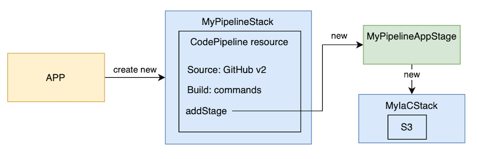

# CDK Pipelines example

This is the public code of the example shown in my blog: <https://www.playingaws.com/posts/how-to-add-ci-cd-to-my-cdk-project/#how-to-add-cicd-to-my-cdk-project-iac> in the `CodePipeline with IaC` section.

Architecture diagram: 
