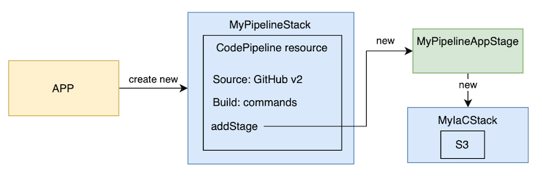
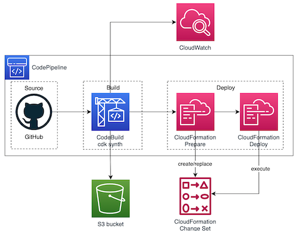

# CDK Pipelines example

This is the public code of the example shown in my blog: <https://www.playingaws.com/posts/how-to-add-ci-cd-to-my-cdk-project/#recommended-deployment-of-codepipeline-to-cdk-projects>.

Explained code to easy understand it: 

Architecture diagram of the generated pipeline: 
